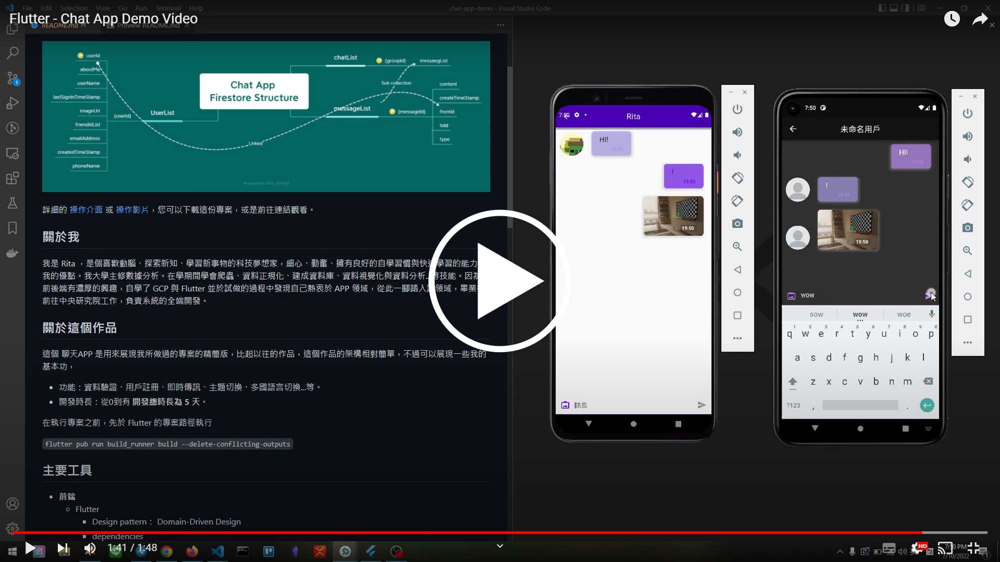

# Chat App Demo

---

## 目錄

1. [作品介紹](#作品介紹) - 快速點餐系統（Order Ease 餐點輕鬆訂）介紹。
2. [Demo 影片](#demo-影片) - 實際 APP 操作影片。
3. [技術清單](#技術清單) - 包含了使用的前端技術和相關工具的版本與清單。

## 作品介紹

### 簡介

- 功能：資料驗證、用戶註冊、即時傳訊、主題切換、多國語言切換...等。
- 開發時長：從 0 到有 **開發總時長為 5 天**。

在執行專案之前，先於 Flutter 的專案路徑執行

`
flutter pub run build_runner build --delete-conflicting-outputs`

## Demo 影片

## 技術清單

- **前端**
  - Flutter
    - Design pattern： Domain-Driven Design
    - dependencies  
      
- **後端**
  - Cloud Firestore
  - Cloud Storage
- **版本控制與資料庫規劃**
  - Git
  - Xmind
